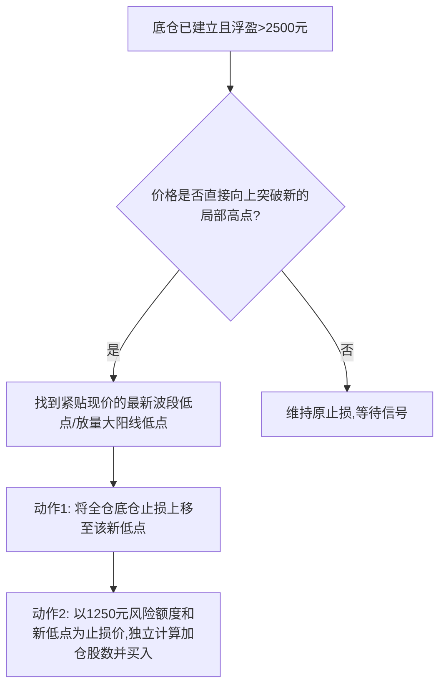
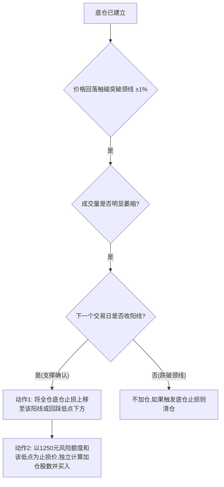

# 交易系统：上涨趋势波段接力系统 v1.0 (Uptrend Pullback & Breakout System)

## 1. 核心架构与风险参数
*   **适用环境**：A股市场，已证明处于多头趋势的标的。
*   **基础风险额度 (Base R)**：单笔初始开仓最大允许亏损 **2500元人民币**。
*   **加仓风险额度 (Scale R)**：加仓交易的最大允许亏损减半，即 **1250元人民币**。
*   **资金管理公式**：`买入股数 = 允许的风险额度 ÷ (买入价 - 止损价)`。绝不允许主观定仓位。

## 2. 阶段一：环境过滤器 (Market Regime) - 系统启动前提
必须同时满足以下三个条件，系统才允许进入“准备开仓”状态：
1. **形态确认**：出现 5K线分形波段低点（左2K线和右2K线的最低价均高于中心K线最低价），确认回调见底。
2. **深度防守红线**：当前回调的绝对低点，未跌穿前一波段涨幅的 **61.8%**（允许刺穿至65%，但收盘必须站回）。
3. **量能否决（核心）**：回调期间的所有下跌阴线，成交量均**未超过** 20日均量的 1.5 倍（必须是缩量洗盘）。

## 3. 阶段二：双轨入场机制 (Dual-Track Entry) - 底仓建立
*   **初始止损设定 (Hard Stop)**：止损线刚性锚定在环境过滤器中找到的 **“5K线波段低点下方 0.5%”**。

*   **轨道A：周线共振（激进左侧）**
    *   **触发条件**：周线价格距离周线前高 < `5%` AND 日线盘中突破日线前高 AND 盘中动态预估成交量 > `1.5`倍均量。
    *   **动作**：无需等尾盘，盘中直接代入公式计算股数，打入底仓（风险=2500元）。
*   **轨道B：单日线突破（稳健右侧）**
    *   **触发条件**：周线未共振（距离前高>5%） AND 时间到达 `14:30`之后 AND 日线收盘价维持在突破前高之上 AND 当日成交量 > `1.5`倍均量。
    *   **动作**：尾盘代入公式计算股数，打入底仓（风险=2500元）。

## 4. 阶段三：双引擎加仓与止损追踪 (Scaling In & Trailing Stop)
一旦底仓脱离成本区（浮盈 > 2500元），启动以下两个加仓引擎（先满足哪个执行哪个）。

### 引擎 1：不回踩直接逼空走势 (Momentum Scaling)

### 引擎 2：标准缩量回踩走势 (Pullback Scaling)

## 5. 系统总结与评估 (System Evaluation)
- **优势**：极度注重风险控制。通过合并上移止损和金字塔递减风险，即使加仓后立刻遭遇黑天鹅爆仓，账户总体亏损极小甚至依然有盈利。
- **难点**：对执行力要求极高。A股主力经常刺穿防守线后迅速拉回，系统使用者必须像机器一样执行止损，并在形态修复后有勇气重新代入公式买入。