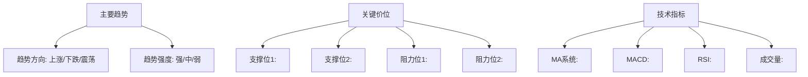

# 期货交易日志模板

## 交易基本信息

### 交易编号: `[自动生成]`
**交易日期**: `YYYY-MM-DD`
**交易员**: `[姓名]`
**交易账户**: `[账户名称]`

## 市场分析记录

### 盘前分析 (`日期: YYYY-MM-DD`)
#### 宏观经济环境
- **重要数据发布**: 
- **政策动向**: 
- **国际市场影响**: 

#### 技术分析


#### 基本面分析
- **供需状况**: 
- **库存数据**: 
- **季节性因素**: 
- **市场情绪**: 

#### 交易机会识别
1. **机会1**: 
   - 入场理由: 
   - 预期收益: 
   - 风险评估: 
2. **机会2**: 
   - 入场理由: 
   - 预期收益: 
   - 风险评估: 

## 交易执行记录

### 交易计划
**品种**: `[期货品种]`
**合约**: `[合约代码]`
**方向**: `[做多/做空]`
**计划入场价**: `[价格]`
**计划止损价**: `[价格]`
**计划止盈价**: `[价格]`
**计划仓位**: `[手数]`
**预期持仓时间**: `[小时/天]`

### 风险计算
```python
# 风险参数计算
账户资金: [金额]
单笔风险比例: [%]
最大风险金额: [金额] = 账户资金 × 风险比例
止损点数: [点数]
每点价值: [金额/点]
最大手数: [手数] = 最大风险金额 ÷ (止损点数 × 每点价值)
```

### 实际执行
**实际入场时间**: `HH:MM:SS`
**实际入场价格**: `[价格]`
**实际手数**: `[手数]`
**执行方式**: `[市价单/限价单]`
**滑点情况**: `[点数]`
**备注**: 

## 持仓管理记录

### 持仓监控
**监控时间**: `HH:MM`
**当前价格**: `[价格]`
**浮动盈亏**: `[金额]`
**风险状况**: `[正常/预警/危险]`
**调整建议**: 

### 止损调整记录
| 时间 | 原止损价 | 新止损价 | 调整理由 | 批准人 |
|------|----------|----------|----------|--------|
|      |          |          |          |        |

### 止盈调整记录
| 时间 | 原止盈价 | 新止盈价 | 调整理由 | 批准人 |
|------|----------|----------|----------|--------|
|      |          |          |          |        |

## 平仓记录

### 平仓信息
**平仓时间**: `HH:MM:SS`
**平仓价格**: `[价格]`
**平仓方式**: `[手动平仓/止损触发/止盈触发]`
**持仓时间**: `[小时]`
**最终盈亏**: `[金额]`
**盈亏比例**: `[%]`

### 平仓分析
**平仓原因**: 
- [ ] 达到止盈目标
- [ ] 触发止损
- [ ] 技术信号反转
- [ ] 基本面变化
- [ ] 风险控制要求
- [ ] 其他: 

**执行评价**: 
- 入场时机: [优秀/良好/一般/较差]
- 出场时机: [优秀/良好/一般/较差]
- 风险管理: [优秀/良好/一般/较差]
- 纪律执行: [优秀/良好/一般/较差]

## 交易复盘

### 交易总结
**成功之处**: 
1. 
2. 
3. 

**不足之处**: 
1. 
2. 
3. 

**经验教训**: 
1. 
2. 
3. 

### 改进建议
**技术分析改进**: 
**风险管理改进**: 
**执行纪律改进**: 
**心理控制改进**: 

### 绩效评估
```python
# 交易绩效指标
实际风险收益比: [比例]
最大浮动盈利: [金额]
最大浮动亏损: [金额]
持仓期间最大回撤: [%]
交易质量评分: [1-10分]
```

## 附件记录

### 图表截图
- [ ] 入场时图表
- [ ] 持仓期间关键图表
- [ ] 平仓时图表
- [ ] 其他相关图表

### 相关文档
- [ ] 分析报告
- [ ] 风险计算表
- [ ] 沟通记录
- [ ] 其他文档

## 审批记录

### 交易审批
**分析员建议**: 
**建议人**: `[姓名]`
**建议时间**: `YYYY-MM-DD HH:MM`

**管理员审批**: 
**审批意见**: 
**审批人**: `[姓名]`
**审批时间**: `YYYY-MM-DD HH:MM`

### 风险审批
**风险监控员意见**: 
**监控员**: `[姓名]`
**监控时间**: `YYYY-MM-DD HH:MM`

**风险经理审批**: 
**审批意见**: 
**审批人**: `[姓名]`
**审批时间**: `YYYY-MM-DD HH:MM`

## 模板使用说明

### 填写指南
1. **交易前**: 完整填写"市场分析"和"交易计划"部分
2. **交易中**: 实时记录"持仓管理"和调整记录
3. **交易后**: 及时完成"平仓记录"和"交易复盘"
4. **定期**: 每周/每月汇总分析交易日志

### 注意事项
1. 所有价格和金额需准确填写，保留两位小数
2. 时间记录精确到秒
3. 图表截图需标注关键信息
4. 审批记录需相关人员签字确认
5. 交易编号按规则自动生成

### 归档要求
1. 每笔交易独立建档
2. 按月份分类存储
3. 定期备份电子档案
4. 重要交易纸质存档

---
*日志模板版本: 1.0*
*最后更新: 2026年4月10日*