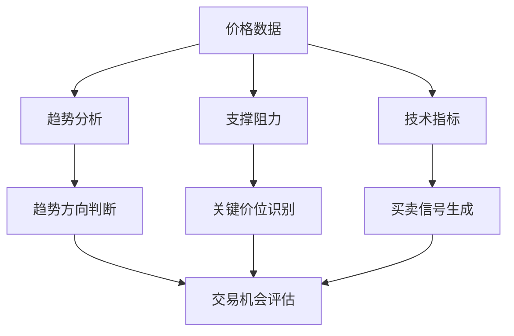
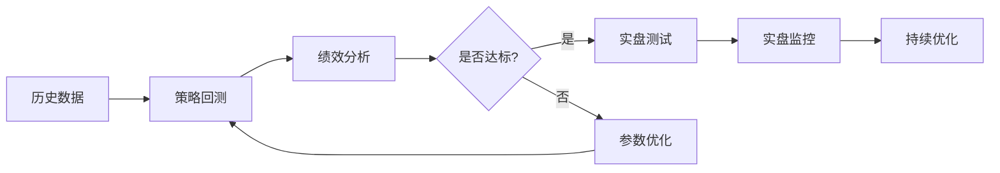

# 期货交易系统框架

## 系统概述

### 设计原则
1. **可重复性**: 交易逻辑清晰，可重复执行
2. **可验证性**: 可通过历史数据回测验证
3. **适应性**: 能适应不同市场环境
4. **风险可控**: 内置严格的风险管理机制

## 核心组件

### 1. 市场分析模块

#### 技术分析子系统


**技术指标配置**:
- **趋势指标**: MA(5,20,60), MACD, ADX
- **动量指标**: RSI(14), Stochastic(14,3,3)
- **波动指标**: ATR(14), Bollinger Bands(20,2)
- **成交量指标**: Volume, OBV

#### 基本面分析子系统
- **供需分析**: 库存数据、产量预测、消费趋势
- **宏观经济**: GDP、CPI、利率政策
- **季节性因素**: 农产品季节性规律
- **政策影响**: 政府政策、贸易协议

### 2. 交易信号模块

#### 入场信号
**多条件确认系统**:
1. **趋势确认**: 价格在主要均线之上/下
2. **动量确认**: RSI/Stochastic显示超买超卖
3. **形态确认**: 关键图表形态突破
4. **成交量确认**: 突破时成交量放大

#### 出场信号
1. **止盈目标**: 基于风险收益比(1:2或1:3)
2. **止损设置**: 基于ATR或关键支撑阻力
3. **时间止损**: 持仓超过设定时间自动平仓
4. **跟踪止损**: 盈利后逐步上移止损

### 3. 风险管理模块

#### 仓位管理
```python
# 仓位计算公式
def calculate_position_size(account_balance, risk_per_trade, stop_loss_pips):
    """
    计算每笔交易的仓位大小
    account_balance: 账户余额
    risk_per_trade: 单笔交易风险比例(如0.02表示2%)
    stop_loss_pips: 止损点数
    """
    risk_amount = account_balance * risk_per_trade
    position_size = risk_amount / stop_loss_pips
    return position_size
```

#### 风险控制规则
1. **单笔风险**: ≤ 2% 账户资金
2. **单日风险**: ≤ 5% 账户资金
3. **单品种风险**: ≤ 10% 账户资金
4. **相关性风险**: 高度相关品种总风险 ≤ 15%

### 4. 执行模块

#### 下单规则
1. **限价单**: 在预设价格入场
2. **市价单**: 突破确认后立即入场
3. **条件单**: 满足特定条件自动触发

#### 执行纪律
1. **严格执行止损**: 绝不移动止损
2. **分批入场**: 重要位置分批建仓
3. **分批离场**: 盈利后分批减仓
4. **交易记录**: 详细记录每笔交易

## 系统优化流程

### 回测优化


### 优化指标
1. **收益风险比**: 年化收益 / 最大回撤
2. **胜率**: 盈利交易比例
3. **盈亏比**: 平均盈利 / 平均亏损
4. **夏普比率**: 风险调整后收益
5. **最大回撤**: 最大资金回撤幅度

## 期货品种特定配置

### 农产品期货
- **特点**: 季节性明显，受天气影响大
- **分析重点**: 供需报告、天气预测、种植面积
- **交易时间**: 关注USDA报告发布时间

### 能源化工期货
- **特点**: 波动大，受地缘政治影响
- **分析重点**: 库存数据、OPEC决策、地缘局势
- **交易时间**: 关注EIA库存报告

### 金属期货
- **特点**: 与经济周期相关性强
- **分析重点**: 工业需求、美元走势、库存变化
- **交易时间**: 关注中国PMI数据

### 金融期货
- **特点**: 流动性好，信息透明
- **分析重点**: 宏观经济数据、政策预期
- **交易时间**: 关注重要经济数据发布

## 系统维护与更新

### 日常维护
1. **数据更新**: 确保历史数据完整准确
2. **参数检查**: 定期检查系统参数有效性
3. **异常监控**: 监控系统运行异常

### 定期更新
1. **月度回顾**: 分析系统表现，微调参数
2. **季度评估**: 全面评估系统有效性
3. **年度重构**: 必要时重构交易逻辑

## 团队协作配置

### 分析员职责
1. 市场数据收集整理
2. 技术分析图表制作
3. 基本面研究报告
4. 交易机会初步筛选

### 下单员职责
1. 严格执行交易指令
2. 实时监控持仓风险
3. 交易记录准确填写
4. 异常情况及时报告

### 管理者职责
1. 系统整体监控
2. 风险控制决策
3. 团队绩效评估
4. 系统优化方向确定

---
*系统版本: 1.0 - 基础框架*
*适用对象: 0-3人小型期货交易团队*
*最后更新: 2026年4月10日*