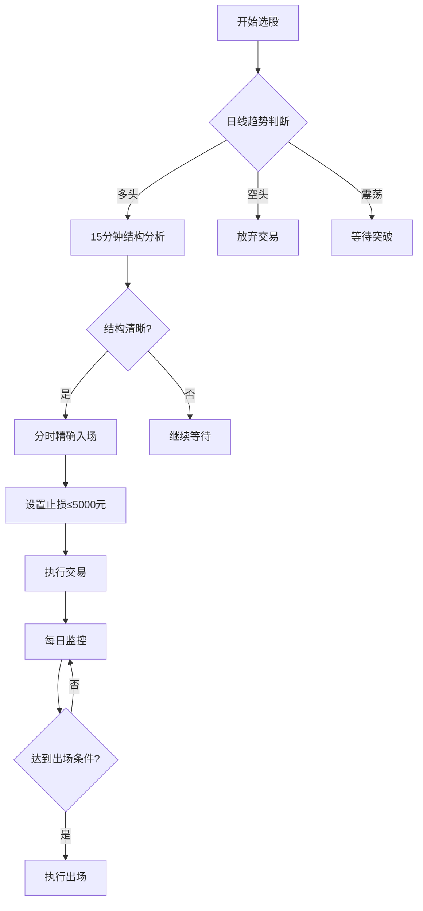

# 股票交易快速指南

## 一、核心流程图



## 二、关键指标速查

### 2.1 日线级别（决策）
- **EMA5>EMA15**：多头趋势 ✓
- **成交量配合**：上涨放量 ✓
- **MACD位置**：零轴上方 ✓
- **三者一致**：最佳交易机会

### 2.2 15分钟级别（操作）
- **结构类型**：
  - 回调结构（ABC、横盘）
  - 突破结构（平台、三角）
- **成交量**：萎缩后放大
- **MACD**：金叉或即将金叉

### 2.3 分时级别（执行）
- **均线支撑**：分时均线不破
- **放量确认**：拉升时放量
- **关键价位**：突破重要位置

## 三、交易信号速查表

### 3.1 买入信号（必须全部满足）
| 级别 | 条件 | 说明 |
|------|------|------|
| 日线 | EMA5>EMA15 | 多头趋势 |
| 日线 | 成交量温和 | 健康上涨 |
| 15分钟 | 清晰结构 | 回调/突破 |
| 15分钟 | 成交量配合 | 萎缩后放大 |
| 分时 | 均线支撑 | 回调不破 |
| 分时 | 放量确认 | 拉升放量 |

### 3.2 卖出信号（满足任一）
| 类型 | 条件 | 说明 |
|------|------|------|
| 止损 | 亏损≥5000元 | 绝对止损 |
| 止损 | 跌破关键支撑 | 技术止损 |
| 止盈 | 风险报酬比≥1:2 | 目标止盈 |
| 止盈 | 日线EMA5下穿EMA15 | 趋势反转 |

## 四、仓位计算器

### 4.1 快速计算公式
```
仓位 = 5000 ÷ (入场价 × 止损百分比)
```

### 4.2 示例计算
- 股票价格：50元
- 止损幅度：4%
- 止损价差：50 × 4% = 2元
- 可买股数：5000 ÷ 2 = 2500股
- 占用资金：2500 × 50 = 125,000元

### 4.3 仓位限制
- **单只股票**：≤总资金30%
- **总持仓**：≤总资金80%
- **持仓数量**：≤3只

## 五、每日检查清单

### 5.1 盘前准备
- [ ] 大盘环境评估（上证、创业板）
- [ ] 自选股更新（移除走坏，加入新机会）
- [ ] 持仓股票检查（止损位、目标位）
- [ ] 新闻面浏览（重大利好利空）

### 5.2 交易时间
- [ ] 严格执行交易计划
- [ ] 不临时起意交易
- [ ] 记录每笔交易理由
- [ ] 监控止损位

### 5.3 盘后复盘
- [ ] 当日交易总结
- [ ] 计划与实际对比
- [ ] 心理状态记录
- [ ] 明日计划制定

## 六、常见场景处理

### 6.1 强势上涨中的回调
**特征**：日线多头，15分钟回调至EMA15
**操作**：
1. 等待成交量萎缩
2. 分时均线支撑确认
3. 放量时入场
4. 止损：跌破15分钟EMA15

### 6.2 震荡突破
**特征**：日线震荡，15分钟平台突破
**操作**：
1. 等待放量突破
2. 回踩不破入场
3. 止损：跌破突破平台

### 6.3 弱势反弹
**特征**：日线空头，15分钟反弹
**操作**：放弃交易，不逆势

## 七、心理提示

### 7.1 必须记住
- ✅ 亏损是交易成本，接受它
- ✅ 错过机会比做错好
- ✅ 规则大于感觉
- ✅ 耐心等待最佳机会

### 7.2 必须避免
- ❌ 凭感觉交易
- ❌ 不止损扛单
- ❌ 频繁交易
- ❌ 重仓赌博

## 八、紧急情况处理

### 8.1 突发利空
1. 立即评估影响程度
2. 如果跌破止损，立即卖出
3. 如果未破止损，观察市场反应

### 8.2 系统故障
1. 电话委托备用
2. 提前设置条件单
3. 保持冷静，按计划执行

### 8.3 情绪失控
1. 停止交易
2. 离开电脑
3. 回顾交易规则
4. 恢复平静后再交易

---

## 九、模板快速生成

### 9.1 交易计划模板（简化版）
```
股票：______ 价格：______
日线趋势：多头/空头/震荡
15分钟结构：回调/突破/无
入场条件：______
止损：______ (≤5000元)
目标：______
仓位：______股
```

### 9.2 复盘模板（简化版）
```
日期：______ 股票：______
盈亏：______ 持仓：______天
计划执行：好/中/差
主要问题：______
改进措施：______
```

---

**使用提示**：
1. 打印本指南放在交易台前
2. 交易前必须阅读相关部分
3. 每周回顾一次完整系统
4. 每月统计交易数据优化系统