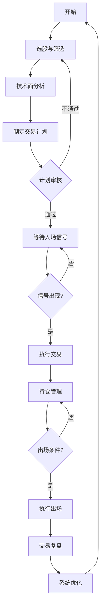

# 股票交易系统使用指南

## 一、系统概述与定位

### 1.1 系统定位
本系统是基于期货交易系统核心思想简化的**股票波段交易系统**，专为A股市场设计，适用于：
- 个人投资者
- 波段交易者
- 风险厌恶型交易者
- 希望建立系统化交易流程的交易者

### 1.2 设计原则
- **简单有效**：指标精简，避免过度优化
- **风险控制**：单笔亏损≤5000元，严格止损
- **流程完整**：计划→执行→复盘闭环
- **心理友好**：规则明确，减少情绪干扰

### 1.3 文件结构
```
股票交易系统/
├── 股票交易系统1.0.md          # 完整系统文档
├── 股票交易快速指南.md          # 速查手册
├── 股票交易计划模板.md          # 交易前计划
├── 股票交易复盘模板.md          # 交易后复盘
└── 股票交易系统使用指南.md      # 本文件
```

## 二、系统使用流程

### 2.1 完整交易流程


### 2.2 每日工作流程
**盘前（9:00前）**：
1. 阅读《股票交易快速指南》关键要点
2. 检查持仓股票状态
3. 更新自选股列表
4. 制定当日交易计划（如有机会）

**盘中（9:30-15:00）**：
1. 监控计划中的股票
2. 严格执行交易计划
3. 记录交易执行情况
4. 不临时起意交易

**盘后（15:00后）**：
1. 完成当日交易复盘
2. 更新交易统计数据
3. 准备次日交易计划
4. 每周五进行周度复盘

## 三、核心文件使用说明

### 3.1 《股票交易系统1.0.md》
**使用时机**：系统学习、规则查询、参数调整

**主要内容**：
- 完整的技术分析框架
- 详细的交易规则
- 风险管理体系
- 实战案例

**使用建议**：
- 初次使用前通读全文
- 每月回顾一次完整系统
- 优化系统时参考此文件

### 3.2 《股票交易快速指南.md》
**使用时机**：日常交易、快速查询、紧急参考

**主要内容**：
- 核心流程图
- 关键指标速查
- 仓位计算器
- 每日检查清单

**使用建议**：
- 打印放在交易台前
- 交易前必读相关部分
- 遇到疑问时快速查询

### 3.3 《股票交易计划模板.md》
**使用时机**：每次交易前

**使用步骤**：
1. **填写标的信息**：股票名称、代码、价格
2. **分析交易理由**：基本面+技术面
3. **制定交易计划**：入场、止损、目标、仓位
4. **心理准备**：预想各种情况
5. **计划确认**：签字确认执行

**重要提醒**：
- 无计划不交易
- 计划必须完整填写
- 实际执行后填写记录部分

### 3.4 《股票交易复盘模板.md》
**使用时机**：每次交易后、每日、每周、每月

**复盘类型**：
- **单笔交易复盘**：每笔交易结束后立即进行
- **每日复盘**：总结当日所有交易
- **每周复盘**：统计周度数据，优化系统
- **月度复盘**：全面评估系统表现

**复盘重点**：
1. 技术分析准确性
2. 交易执行情况
3. 风险管理效果
4. 心理状态分析
5. 系统优化建议

## 四、关键工具与技巧

### 4.1 仓位计算器使用
**公式**：`仓位 = 5000 ÷ (入场价 × 止损百分比)`

**示例**：
- 股票价格：60元
- 止损幅度：4%
- 止损价差：60 × 4% = 2.4元
- 可买股数：5000 ÷ 2.4 ≈ 2083股
- 占用资金：2083 × 60 = 124,980元

**注意事项**：
- 计算结果取整到100股
- 检查是否超过单只股票仓位限制（≤30%）
- 检查是否超过总仓位限制（≤80%）

### 4.2 多时间框架分析技巧
**分析顺序**：
1. **日线（决策）**：看趋势方向
2. **15分钟（操作）**：看交易结构
3. **分时（执行）**：看精确入场点

**一致性原则**：
- 三个时间框架信号一致时，成功率高
- 信号矛盾时，放弃交易或降低仓位
- 大级别趋势优先于小级别信号

### 4.3 止损设置技巧
**止损类型**：
1. **技术止损**：跌破关键支撑位
2. **金额止损**：亏损达到5000元
3. **时间止损**：3-5个交易日不涨

**止损设置原则**：
- 入场前必须确定止损位
- 止损位要有技术依据
- 止损后不后悔，接受亏损

## 五、常见问题解答

### 5.1 系统相关问题
**Q：为什么选择EMA5和EMA15？**
A：EMA5代表短期趋势，EMA15代表中期趋势，两者结合能较好反映趋势状态，且计算简单，适合快速判断。

**Q：为什么单笔亏损限制在5000元？**
A：这是基于风险承受能力和心理承受能力设定的。5000元是一个心理上可以接受的亏损额度，避免因单笔大亏影响后续交易。

**Q：系统适用于所有股票吗？**
A：主要适用于流动性好、波动适中的主板和创业板股票。ST股、次新股、庄股等特殊股票需要谨慎使用。

### 5.2 执行相关问题
**Q：如果错过最佳入场点怎么办？**
A：放弃这笔交易。系统原则是"宁可错过，不做错"。等待下一个符合条件的机会。

**Q：止损后股价又涨回来了怎么办？**
A：接受这个事实。止损是正确的，后续走势无法预测。重要的是执行了规则，保护了资金。

**Q：如何避免频繁交易？**
A：严格按照系统信号交易，不符合条件坚决不交易。每天检查自己的交易次数，超过2笔就要警惕。

### 5.3 心理相关问题
**Q：如何克服害怕止损的心理？**
A：把止损看作交易成本，就像生意的租金。统计显示，正确止损长期来看是盈利的保障。

**Q：盈利时总想提前止盈怎么办？**
A：设置移动止损，让利润奔跑。同时回顾历史交易，看看提前止盈错过了多少利润。

**Q：连续亏损时如何调整心态？**
A：暂停交易1-2天，回顾系统规则，检查是否严格执行。连续亏损往往是执行问题，不是系统问题。

## 六、系统优化与升级

### 6.1 优化流程
1. **数据收集**：记录每笔交易数据
2. **问题识别**：通过复盘发现问题
3. **方案制定**：提出优化建议
4. **小范围测试**：用模拟盘或小仓位测试
5. **全面实施**：验证有效后全面实施

### 6.2 优化方向
**技术面优化**：
- 调整EMA周期
- 优化止损幅度
- 增加辅助指标

**风险管理优化**：
- 调整仓位计算公式
- 优化止损策略
- 增加风险控制规则

**流程优化**：
- 简化交易计划模板
- 优化复盘流程
- 增加自动化工具

### 6.3 版本管理
- **v1.0**：基础版本，建立完整框架
- **后续版本**：根据实战数据优化
- **版本记录**：在《股票交易系统1.0.md》中记录

## 七、实战建议

### 7.1 新手使用建议
1. **模拟盘练习**：先用模拟盘熟悉系统
2. **小仓位开始**：实盘时从小仓位开始
3. **完整流程**：每次交易都走完计划→执行→复盘
4. **记录问题**：遇到问题及时记录并解决

### 7.2 进阶使用建议
1. **个性化调整**：根据自身特点微调系统
2. **数据统计**：建立交易数据库，分析优化
3. **心理训练**：专门进行交易心理训练
4. **系统融合**：将期货系统经验融入股票系统

### 7.3 高级使用建议
1. **多系统验证**：用历史数据回测系统
2. **风险平价**：应用更高级的风险管理
3. **自动化工具**：开发辅助工具提高效率
4. **团队协作**：如果是团队交易，建立协作流程

## 八、资源与支持

### 8.1 学习资源
- **系统文档**：本文件夹中的所有文件
- **期货系统**：参考期货交易系统的核心思想
- **技术分析书籍**：《日本蜡烛图技术》、《股票大作手回忆录》
- **心理训练书籍**：《交易心理分析》、《思考，快与慢》

### 8.2 工具推荐
- **行情软件**：同花顺、东方财富
- **交易软件**：券商提供的交易软件
- **记录工具**：Excel、Notion、Obsidian
- **分析工具**：TradingView（可选）

### 8.3 支持渠道
- **自我复盘**：通过复盘模板自我提升
- **交易日志**：记录交易心得和问题
- **学习小组**：如有条件，组建学习小组
- **专业指导**：必要时寻求专业指导

---

## 九、开始使用

### 9.1 第一步：系统学习
1. 通读《股票交易系统1.0.md》
2. 理解核心思想和流程
3. 标记不理解的地方

### 9.2 第二步：模拟练习
1. 用模拟盘练习选股和分析
2. 填写交易计划模板
3. 模拟交易并复盘

### 9.3 第三步：小仓位实盘
1. 选择1-2只符合条件的股票
2. 小仓位实盘交易
3. 严格执行系统规则
4. 认真复盘总结

### 9.4 第四步：全面实施
1. 熟悉后全面实施系统
2. 建立交易数据库
3. 定期优化系统
4. 形成自己的交易风格

---

**最后提醒**：
交易系统是工具，执行力是关键。
亏损是交易的一部分，接受它。
持续学习，持续改进。
祝您交易顺利！