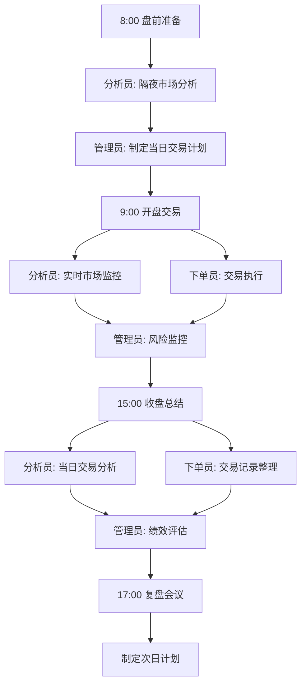
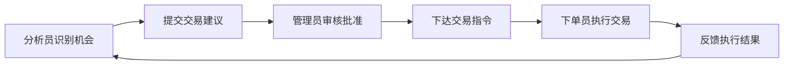
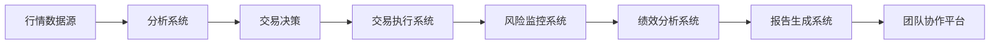

# 小型期货交易团队管理框架

## 团队概述

### 团队规模与结构
- **团队规模**: 0-3人（可根据需求扩展）
- **核心角色**: 分析员、下单员、管理员（可兼任）
- **管理模式**: 扁平化、高效协作

### 团队目标
1. **交易目标**: 实现稳定盈利，年化收益15-30%
2. **风险目标**: 最大回撤控制在15%以内
3. **成长目标**: 团队成员技能持续提升
4. **规模目标**: 逐步扩大管理资金规模

## 团队角色与职责

### 分析员 (Analyst)
#### 核心职责
1. **市场分析**: 每日市场分析报告
2. **机会识别**: 交易机会筛选与评估
3. **策略研究**: 交易策略研究与优化
4. **数据管理**: 市场数据收集与整理

#### 技能要求
- 精通技术分析和基本面分析
- 熟悉期货市场运作机制
- 具备数据分析和研究能力
- 良好的报告撰写能力

#### 工作产出
- 每日市场分析报告
- 交易机会清单
- 策略回测报告
- 风险提示报告

### 下单员 (Trader)
#### 核心职责
1. **交易执行**: 严格执行交易指令
2. **风险监控**: 实时监控持仓风险
3. **交易记录**: 准确记录交易信息
4. **执行反馈**: 提供执行情况反馈

#### 技能要求
- 快速准确的交易执行能力
- 严格的纪律性和执行力
- 熟悉交易软件操作
- 良好的心理素质

#### 工作产出
- 交易执行记录
- 风险监控报告
- 执行问题反馈
- 交易绩效数据

### 管理员 (Manager)
#### 核心职责
1. **团队管理**: 协调团队工作，分配任务
2. **风险控制**: 整体风险监控与决策
3. **绩效评估**: 团队成员绩效评估
4. **系统优化**: 交易系统持续优化

#### 技能要求
- 丰富的交易管理经验
- 全面的风险管理能力
- 良好的领导与沟通能力
- 系统化思维能力

#### 工作产出
- 团队工作计划
- 风险管理决策
- 绩效评估报告
- 系统优化方案

## 团队工作流程

### 每日工作流程


### 详细时间安排

#### 盘前阶段 (8:00-9:00)
1. **8:00-8:30**: 分析员准备隔夜市场分析报告
2. **8:30-8:45**: 管理员审阅报告，制定交易计划
3. **8:45-9:00**: 团队会议，明确当日交易重点

#### 盘中阶段 (9:00-15:00)
1. **实时监控**: 分析员监控市场变化，识别交易机会
2. **交易执行**: 下单员根据指令执行交易
3. **风险监控**: 管理员监控整体风险状况
4. **沟通协调**: 团队成员保持实时沟通

#### 盘后阶段 (15:00-17:00)
1. **15:00-15:30**: 分析员整理当日交易分析
2. **15:30-16:00**: 下单员整理交易记录
3. **16:00-16:30**: 管理员进行绩效评估
4. **16:30-17:00**: 团队复盘会议

## 团队协作机制

### 信息沟通流程

#### 交易指令传递


#### 风险信息通报
1. **风险预警**: 分析员发现风险信号立即通报
2. **风险决策**: 管理员根据风险情况做出决策
3. **风险执行**: 下单员执行风险控制措施
4. **风险记录**: 记录风险事件和处理过程

### 决策机制

#### 常规决策
- **分析员**: 交易机会识别和初步评估
- **管理员**: 交易决策和风险控制决策
- **下单员**: 执行细节决策（如具体入场点位）

#### 重大决策
- **团队讨论**: 重要策略调整需团队讨论
- **风险评估**: 重大决策前进行风险评估
- **记录备案**: 重大决策需记录备案

## 绩效管理体系

### 绩效评估指标

#### 团队整体绩效
1. **收益率**: 年化收益率、月度收益率
2. **风险指标**: 最大回撤、夏普比率、索提诺比率
3. **稳定性**: 收益曲线平滑度、胜率一致性
4. **规模增长**: 管理资金规模增长

#### 个人绩效
**分析员评估指标**:
1. 交易机会识别准确率
2. 分析报告质量
3. 策略研究贡献
4. 风险预警及时性

**下单员评估指标**:
1. 交易执行准确率
2. 执行速度与滑点控制
3. 交易记录完整性
4. 风险监控及时性

**管理员评估指标**:
1. 团队整体绩效
2. 风险管理效果
3. 团队协作效率
4. 系统优化贡献

### 绩效评估周期
1. **每日评估**: 当日交易绩效初步评估
2. **每周评估**: 周度绩效总结与改进
3. **月度评估**: 月度绩效正式评估与奖励
4. **季度评估**: 季度全面评估与策略调整

### 激励机制

#### 物质激励
```python
def calculate_bonus(base_salary, team_performance, personal_performance):
    """
    奖金计算函数
    base_salary: 基本工资
    team_performance: 团队绩效系数 (0.8-1.2)
    personal_performance: 个人绩效系数 (0.8-1.2)
    """
    performance_bonus = base_salary * 0.3  # 绩效奖金基数
    total_bonus = performance_bonus * team_performance * personal_performance
    return total_bonus
```

#### 非物质激励
1. **技能提升**: 提供培训和学习机会
2. **职业发展**: 明确的晋升通道
3. **决策参与**: 参与重要决策的机会
4. **荣誉认可**: 优秀表现的公开认可

## 团队培训与发展

### 培训体系

#### 新成员培训
1. **基础培训** (2周): 期货基础知识、团队流程
2. **岗位培训** (4周): 岗位技能专项培训
3. **实战训练** (8周): 模拟交易实战训练
4. **考核评估** (2周): 综合能力考核评估

#### 在职培训
1. **每周学习会**: 市场分析、交易技巧分享
2. **月度培训**: 专题技能提升培训
3. **季度研讨**: 交易策略研讨与优化
4. **年度进修**: 外部培训或专业认证

### 职业发展路径

#### 分析员发展路径
```
初级分析员 → 中级分析员 → 高级分析员 → 首席分析师
    ↓           ↓           ↓           ↓
基础分析   独立分析   策略研究   团队指导
```

#### 下单员发展路径
```
初级下单员 → 中级下单员 → 高级下单员 → 交易主管
    ↓           ↓           ↓           ↓
执行交易   风险监控   策略执行   团队管理
```

#### 管理员发展路径
```
团队管理员 → 交易经理 → 投资总监 → 合伙人
    ↓           ↓           ↓           ↓
团队协调   策略管理   资金管理   业务拓展
```

## 风险管理与合规

### 团队风险控制

#### 权限管理
1. **交易权限**: 明确各角色交易权限范围
2. **风险权限**: 设定各层级风险决策权限
3. **资金权限**: 控制资金调动和使用权限
4. **信息权限**: 管理敏感信息访问权限

#### 内部控制
1. **职责分离**: 分析、决策、执行职责分离
2. **双重确认**: 重要操作需双重确认
3. **交易监控**: 实时监控交易活动
4. **定期审计**: 定期进行内部审计

### 合规管理
1. **法规遵守**: 严格遵守期货交易法规
2. **信息披露**: 按规定进行信息披露
3. **客户保护**: 保护客户利益和隐私
4. **伦理规范**: 遵守职业道德和伦理规范

## 团队文化建设

### 核心价值观
1. **专业专注**: 追求专业 excellence，专注交易本质
2. **诚信透明**: 诚实守信，信息透明
3. **协作共赢**: 团队协作，共同成长
4. **持续改进**: 不断学习，持续优化

### 团队活动
1. **每日站会**: 简短高效的每日沟通
2. **每周复盘**: 深入的交易复盘与学习
3. **月度团建**: 团队建设活动，增强凝聚力
4. **季度总结**: 季度工作总结与规划

### 沟通文化
1. **开放沟通**: 鼓励开放、坦诚的沟通
2. **建设性反馈**: 提供建设性的反馈意见
3. **知识分享**: 积极分享知识和经验
4. **问题解决**: 聚焦问题解决，而非指责

## 技术工具支持

### 交易工具
1. **交易软件**: 文华财经、博易大师等
2. **分析工具**: TradingView、Python分析库
3. **风险工具**: 风险监控系统、绩效分析工具
4. **协作工具**: 企业微信、钉钉等协作平台

### 数据管理
1. **行情数据**: 实时行情数据接入
2. **交易数据**: 交易记录数据库
3. **分析数据**: 分析报告文档管理
4. **风险数据**: 风险监控数据存储

### 系统集成


## 团队扩展规划

### 规模扩展路径
1. **阶段一** (0-3人): 核心团队建设，系统验证
2. **阶段二** (4-6人): 团队分工细化，流程优化
3. **阶段三** (7-10人): 专业化分工，系统化运营
4. **阶段四** (10+人): 多策略团队，规模化运营

### 资金管理扩展
1. **自有资金阶段**: 管理团队自有资金
2. **亲友资金阶段**: 管理亲友委托资金
3. **小型基金阶段**: 成立小型交易基金
4. **专业资管阶段**: 专业资产管理机构

### 策略扩展路径
1. **单一策略**: 专注单一交易策略
2. **多策略**: 开发多个互补策略
3. **多市场**: 扩展至多个期货市场
4. **多资产**: 扩展至其他金融资产

---
*团队管理框架版本: 1.0*
*适用规模: 0-3人小型期货交易团队*
*最后更新: 2026年4月10日*