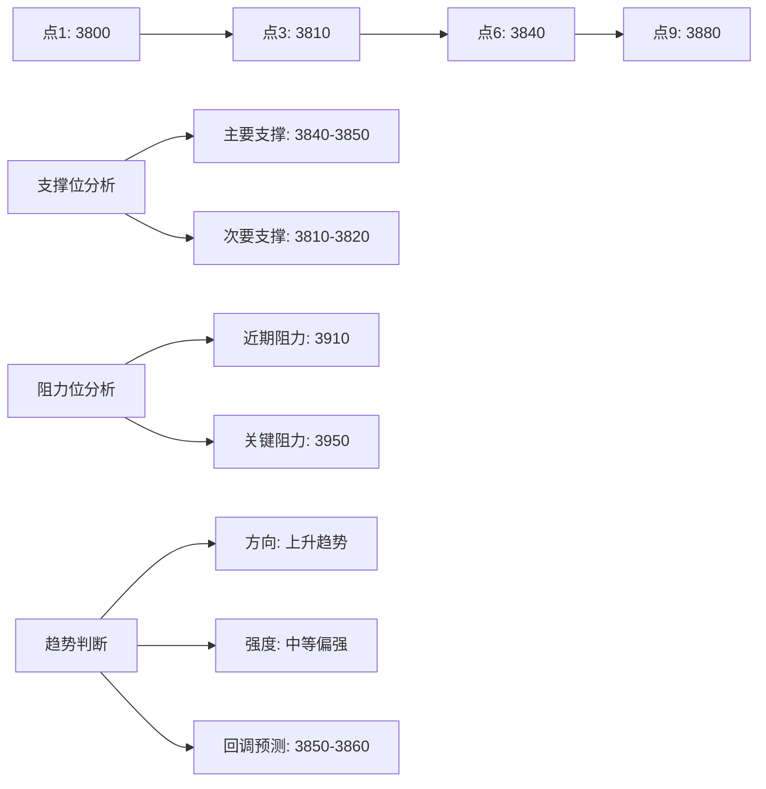

# 技术分析实战练习

## 练习目标

通过系统化的实战练习，掌握期货交易技术分析的核心技能，包括：
1. K线图识别与分析
2. 趋势判断与趋势线绘制
3. 技术指标应用
4. 图表形态识别
5. 综合交易决策

## 练习一：K线图基础识别

### 练习内容
分析以下K线形态，判断其含义和交易信号：

#### 示例1：单根K线识别
```
价格走势: 开盘3800 → 最高3850 → 最低3780 → 收盘3845
```
**问题**:
1. 这是什么类型的K线？
2. 实体长度是多少？
3. 上下影线长度是多少？
4. 该K线传递什么市场信号？

#### 示例2：K线组合识别
```
第一天: 大阴线，收盘3750
第二天: 小实体十字星，收盘3755
第三天: 大阳线，收盘3820
```
**问题**:
1. 这是什么K线组合？
2. 该组合出现在什么位置时信号最强？
3. 应该采取什么交易策略？

### 参考答案
```python
# 示例1分析
k线类型 = "带下影线的阳线"
实体长度 = 3845 - 3800 = 45点
上影线长度 = 3850 - 3845 = 5点
下影线长度 = 3800 - 3780 = 20点
市场信号 = "多头力量较强，但上方有压力，下方有支撑"

# 示例2分析
k线组合 = "早晨之星"
最强位置 = "下跌趋势末端"
交易策略 = "考虑做多，止损设在十字星低点下方"
```

## 练习二：趋势分析与趋势线绘制

### 练习内容
给定以下价格序列，绘制趋势线并判断趋势：

#### 价格数据
```
时间点:  1   2   3   4   5   6   7   8   9   10
价格:   3800 3820 3810 3830 3850 3840 3870 3890 3880 3910
```

**任务**:
1. 在图表上绘制上升趋势线
2. 识别关键支撑位和阻力位
3. 判断当前趋势强度和方向
4. 预测可能的回调位置

### 参考答案


## 练习三：技术指标应用

### 练习内容
使用以下价格数据计算技术指标：

#### 收盘价数据 (20个交易日)
```
[3800, 3820, 3810, 3830, 3850, 3840, 3870, 3890, 3880, 3910,
 3900, 3920, 3915, 3930, 3950, 3940, 3960, 3980, 3970, 4000]
```

**计算任务**:
1. 计算5日、10日、20日简单移动平均线(MA)
2. 计算相对强弱指数(RSI)，周期14
3. 计算移动平均收敛发散指标(MACD)
4. 计算平均真实波幅(ATR)，周期14

### 参考答案模板
```python
import numpy as np

# 价格数据
prices = np.array([3800, 3820, 3810, 3830, 3850, 3840, 3870, 3890, 3880, 3910,
                   3900, 3920, 3915, 3930, 3950, 3940, 3960, 3980, 3970, 4000])

# 1. 移动平均线计算
def calculate_ma(prices, period):
    """计算简单移动平均线"""
    ma = np.zeros_like(prices, dtype=float)
    for i in range(len(prices)):
        if i < period - 1:
            ma[i] = np.nan
        else:
            ma[i] = np.mean(prices[i-period+1:i+1])
    return ma

ma5 = calculate_ma(prices, 5)
ma10 = calculate_ma(prices, 10)
ma20 = calculate_ma(prices, 20)

print(f"最新MA5: {ma5[-1]:.2f}")
print(f"最新MA10: {ma10[-1]:.2f}")
print(f"最新MA20: {ma20[-1]:.2f}")

# 2. RSI计算
def calculate_rsi(prices, period=14):
    """计算相对强弱指数"""
    deltas = np.diff(prices)
    seed = deltas[:period+1]
    up = seed[seed >= 0].sum()/period
    down = -seed[seed < 0].sum()/period
    rs = up/down
    rsi = np.zeros_like(prices)
    rsi[:period] = 100. - 100./(1.+rs)
    
    for i in range(period, len(prices)):
        delta = deltas[i-1]
        if delta > 0:
            upval = delta
            downval = 0.
        else:
            upval = 0.
            downval = -delta
        
        up = (up*(period-1) + upval)/period
        down = (down*(period-1) + downval)/period
        rs = up/down
        rsi[i] = 100. - 100./(1.+rs)
    
    return rsi

rsi = calculate_rsi(prices)
print(f"最新RSI: {rsi[-1]:.2f}")

# RSI信号解读
if rsi[-1] > 70:
    print("RSI信号: 超买区域，警惕回调")
elif rsi[-1] < 30:
    print("RSI信号: 超卖区域，可能反弹")
else:
    print("RSI信号: 正常区域")
```

## 练习四：图表形态识别

### 练习内容
分析以下价格图表，识别图表形态：

#### 价格走势图
```
时间:   1  2  3  4  5  6  7  8  9  10 11 12 13 14 15
价格: 3950 3930 3910 3920 3900 3880 3890 3870 3850 3860 3840 3850 3870 3890 3910
高点:    ↑       ↑       ↑               ↑       ↑
低点:        ↓       ↓       ↓       ↓           ↓
```

**识别任务**:
1. 这是什么图表形态？
2. 形态的颈线位置在哪里？
3. 最小价格目标是多少？
4. 确认信号是什么？

### 参考答案
```
1. 形态识别: 头肩底形态
2. 颈线位置: 3910-3920区域
3. 最小目标: 颈线突破后，目标价位 = 颈线 + (颈线 - 头部低点)
            = 3915 + (3915 - 3850) = 3915 + 65 = 3980
4. 确认信号: 价格放量突破颈线位置，回踩不破颈线
```

## 练习五：综合交易决策

### 实战案例
**背景**: 螺纹钢RB2305合约，当前价格3850

**技术分析数据**:
1. 趋势分析: 日线处于上升趋势，小时线回调
2. 支撑阻力: 
   - 支撑位: 3820(前低), 3800(心理关口)
   - 阻力位: 3880(前高), 3900(整数关口)
3. 技术指标:
   - MA: 价格在MA20上方，MA5上穿MA10
   - RSI(14): 58，中性偏强
   - MACD: 快线在慢线上方，柱状线转正
4. 成交量: 近期放量上涨，缩量回调

**基本面信息**:
- 钢厂开工率回升
- 社会库存下降
- 基建需求预期向好

**任务**: 制定完整的交易计划

### 参考答案模板
```markdown
## 交易计划: 螺纹钢RB2305做多

### 1. 交易理由
- 技术面: 上升趋势中的健康回调，关键支撑位附近
- 基本面: 供需格局改善，库存下降
- 资金面: 放量上涨显示资金介入

### 2. 入场策略
- **入场价位**: 3830-3840区间
- **入场条件**: 
  1. 价格回调至支撑区域
  2. 出现看涨K线组合
  3. 成交量配合放大

### 3. 风险管理
- **止损价位**: 3800下方(3820支撑破位)
- **止损理由**: 关键支撑破位，趋势可能反转
- **单笔风险**: ≤2%账户资金

### 4. 目标设定
- **第一目标**: 3880(前高阻力)
- **第二目标**: 3900(整数关口)
- **第三目标**: 3950(扩展目标)
- **风险收益比**: 1:2以上

### 5. 仓位计算
假设账户资金: 1,000,000元
单笔风险比例: 2%
最大风险金额: 20,000元
止损点数: 30点(3830-3800)
每点价值: 10元
建议手数: 20,000 ÷ (30 × 10) = 66.67 ≈ 65手

### 6. 持仓管理
- 价格达到3880: 平仓1/3，止损移至保本价
- 价格达到3900: 平仓1/3，移动止损
- 剩余仓位: 跟踪止损，保护利润

### 7. 监控要点
- 关键支撑3820是否有效
- 成交量变化情况
- 相关品种联动性
- 基本面数据发布
```

## 练习六：模拟交易记录

### 练习要求
使用模拟交易账户，完成以下任务：

1. **选择品种**: 从农产品、黑色系、化工品中各选一个品种
2. **分析周期**: 日线趋势分析 + 小时线入场时机
3. **制定计划**: 完整的交易计划(包括分析、入场、止损、目标)
4. **执行记录**: 记录实际执行情况
5. **复盘总结**: 交易结束后进行复盘

### 模拟交易记录表
```
交易日期: ________
交易品种: ________
合约代码: ________

## 盘前分析
技术分析: 
__________________________________________________
基本面分析: 
__________________________________________________
市场情绪: 
__________________________________________________

## 交易计划
方向: □做多 □做空
计划入场价: ________
计划止损价: ________
计划止盈价: ________
计划仓位: ________手
预期持仓: ________天

风险计算:
账户资金: ________
单笔风险: ________%
风险金额: ________
止损点数: ________
每点价值: ________
计算手数: ________

## 实际执行
实际入场价: ________
实际手数: ________
入场时间: ________
执行方式: □市价单 □限价单
滑点情况: ________

## 持仓管理
[日期: ____] 价格: ____ 浮动盈亏: ____ 操作: ________
[日期: ____] 价格: ____ 浮动盈亏: ____ 操作: ________
[日期: ____] 价格: ____ 浮动盈亏: ____ 操作: ________

## 平仓记录
平仓价格: ________
平仓时间: ________
平仓原因: □止盈 □止损 □手动平仓
最终盈亏: ________
持仓时间: ________天

## 交易复盘
成功之处: 
1. ________
2. ________
3. ________

不足之处: 
1. ________
2. ________
3. ________

经验教训: 
1. ________
2. ________
3. ________

改进计划: 
1. ________
2. ________
3. ________
```

## 练习评估标准

### 技术分析能力评估
| 评估项目 | 优秀(9-10分) | 良好(7-8分) | 合格(6分) | 需要改进(<6分) |
|---------|-------------|------------|----------|--------------|
| K线识别 | 准确识别各种K线形态及其含义 | 能识别主要K线形态 | 能识别基本K线 | 经常误判K线形态 |
| 趋势分析 | 准确判断趋势，合理绘制趋势线 | 基本判断趋势方向 | 趋势判断有时错误 | 无法准确判断趋势 |
| 指标应用 | 熟练应用多种技术指标 | 能应用主要技术指标 | 只会使用简单指标 | 不会使用技术指标 |
| 形态识别 | 准确识别各种图表形态 | 能识别常见图表形态 | 形态识别有时错误 | 无法识别图表形态 |
| 综合决策 | 综合分析，制定合理交易计划 | 能制定基本交易计划 | 计划不够完整 | 无法制定交易计划 |

### 练习建议
1. **每日练习**: 坚持每日分析1-2个品种
2. **记录总结**: 详细记录分析过程和结果
3. **对比验证**: 将自己的分析与实际走势对比
4. **持续学习**: 不断学习新的分析方法和技巧
5. **心理建设**: 培养耐心和纪律性

---
*练习材料版本: 1.0*
*适用对象: 期货交易技术分析学习者*
*建议练习周期: 3-6个月*
*最后更新: 2026年4月10日*