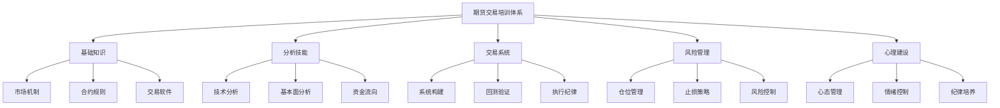

# 期货交易培训大纲

## 培训目标

### 总体目标
培养具备独立分析能力、严格执行纪律、有效管理风险的期货交易专业人才。

### 具体目标
1. **知识掌握**: 理解期货市场运作机制和分析方法
2. **技能提升**: 掌握技术分析和基本面分析技能
3. **心理建设**: 培养良好的交易心态和纪律
4. **实战能力**: 能够独立制定和执行交易计划

## 培训体系结构

## 详细培训内容

### 模块一：期货市场基础 (2周)

#### 第1课：期货市场概述
- 期货市场发展历史
- 期货与现货的区别
- 期货市场功能与作用
- 主要期货交易所介绍

#### 第2课：期货合约机制
- 合约规格解读
- 保证金制度
- 交割机制
- 持仓限额规定

#### 第3课：交易软件操作
- 主流交易软件介绍
- 下单界面操作
- 图表分析工具
- 风险监控功能

### 模块二：技术分析技能 (4周)

#### 第4课：K线图分析
- K线基本形态
- 重要反转形态
- 持续形态识别
- 多时间框架分析

#### 第5课：趋势分析
- 趋势定义与分类
- 趋势线绘制
- 通道分析
- 均线系统应用

#### 第6课：技术指标
- 趋势指标：MA、MACD、ADX
- 动量指标：RSI、Stochastic
- 波动指标：ATR、Bollinger Bands
- 成交量指标：Volume、OBV

#### 第7课：图表形态
- 头肩顶/底形态
- 双顶/双底形态
- 三角形整理形态
- 旗形、楔形形态

### 模块三：基本面分析 (3周)

#### 第8课：宏观经济分析
- GDP、CPI、PMI等指标解读
- 货币政策影响
- 财政政策分析
- 国际经济环境

#### 第9课：品种基本面
- 农产品：供需平衡表分析
- 能源化工：库存数据解读
- 金属：工业需求分析
- 金融期货：利率预期

#### 第10课：季节性分析
- 农产品季节性规律
- 能源需求季节性
- 节假日效应
- 历史季节性统计

### 模块四：交易系统构建 (4周)

#### 第11课：交易哲学
- 成功交易者特质
- 交易系统重要性
- 风险收益比概念
- 长期稳定盈利理念

#### 第12课：入场策略
- 趋势跟踪策略
- 反转交易策略
- 突破交易策略
- 区间交易策略

#### 第13课：出场策略
- 固定止盈止损
- 移动止损策略
- 时间止损策略
- 分批离场策略

#### 第14课：系统回测
- 历史数据获取
- 回测软件使用
- 绩效指标分析
- 参数优化方法

### 模块五：风险管理 (3周)

#### 第15课：资金管理
- 凯利公式应用
- 固定比例风险
- 动态仓位调整
- 资金曲线管理

#### 第16课：止损策略
- 技术止损设置
- 波动率止损
- 资金止损设置
- 心理止损控制

#### 第17课：风险控制
- 单笔风险控制
- 单日风险控制
- 相关性风险控制
- 极端行情应对

### 模块六：交易心理与纪律 (2周)

#### 第18课：交易心理
- 常见心理误区
- 恐惧与贪婪管理
- 亏损心理应对
- 盈利心理调整

#### 第19课：交易纪律
- 交易计划制定
- 执行纪律培养
- 交易记录习惯
- 复盘总结方法

#### 第20课：团队协作
- 分析员与下单员配合
- 信息沟通流程
- 问题解决机制
- 绩效评估标准

## 培训方法

### 理论教学
- 课堂讲解
- 案例分析
- 小组讨论
- 在线学习

### 实践训练
- 模拟交易
- 实盘观摩
- 交易记录分析
- 复盘会议

### 考核评估
- 理论知识测试
- 模拟交易绩效
- 实盘操作评估
- 综合能力考核

## 培训时间安排

### 第一阶段：基础培训 (2个月)
- 每周一、三、五晚上 19:00-21:00
- 周末全天实践训练
- 每月一次综合测试

### 第二阶段：实战训练 (3个月)
- 模拟交易实盘指导
- 每日盘前分析会
- 每日盘后复盘会
- 每周交易总结

### 第三阶段：独立操作 (1个月)
- 独立制定交易计划
- 独立执行交易操作
- 导师远程指导
- 最终考核评估

## 培训资源

### 教材资料
1. 《期货市场技术分析》
2. 《交易系统与方法》
3. 《专业投机原理》
4. 《股票大作手回忆录》

### 软件工具
1. 文华财经/博易大师
2. TradingView图表工具
3. Python回测框架
4. Excel数据分析工具

### 数据资源
1. 历史行情数据
2. 基本面数据库
3. 经济数据日历
4. 研究报告资源

## 培训效果评估

### 评估指标
1. **知识掌握度**: 理论测试成绩
2. **技能熟练度**: 模拟交易绩效
3. **风险控制能力**: 最大回撤控制
4. **心理素质**: 交易纪律执行

### 评估周期
- 每周小测验
- 月度综合评估
- 阶段成果考核
- 最终认证评估

## 培训师资质要求

### 基本要求
1. 5年以上期货交易经验
2. 稳定的实盘交易记录
3. 良好的沟通表达能力
4. 丰富的教学经验

### 专业要求
1. 精通技术分析和基本面分析
2. 熟悉交易系统构建
3. 擅长风险管理
4. 了解交易心理辅导

---
*培训大纲版本: 1.0*
*适用对象: 期货交易初学者及进阶者*
*培训周期: 6个月*
*最后更新: 2026年4月10日*