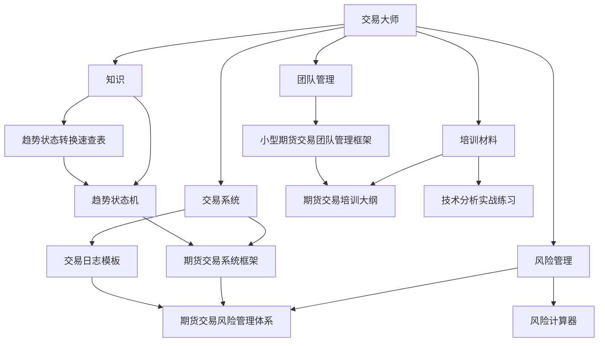

# 交易大师 - 文档索引

## 📁 文档结构总览

```
交易大师/
├── 📄 交易大师.md              # 主配置文件
├── 📄 文档索引.md              # 本文档
├── 📁 交易系统/
│   ├── 📄 期货交易系统框架.md
│   └── 📄 交易日志模板.md
├── 📁 知识/
│   ├── 📄 趋势状态机.md        # 趋势状态机完整模型
│   └── 📄 趋势状态转换速查表.md # 快速参考指南
├── 📁 团队管理/
│   └── 📄 小型期货交易团队管理框架.md
├── 📁 培训材料/
│   ├── 📄 期货交易培训大纲.md
│   └── 📄 技术分析实战练习.md
└── 📁 风险管理/
    ├── 📄 期货交易风险管理体系.md
    └── 📄 风险计算器.py
```

## 🔗 快速导航

### 核心文档
- [[交易大师]] - AI助手主配置文件
- [[期货交易系统框架]] - 系统化交易方法论
- [[趋势状态机]] - 趋势识别与状态演变模型
- [[期货交易风险管理体系]] - 风险控制核心

### 实用工具
- [[交易日志模板]] - 每日交易记录模板
- [[趋势状态转换速查表]] - 趋势状态快速参考
- [[风险计算器]] - Python风险管理工具
- [[技术分析实战练习]] - 技术分析训练材料

### 管理框架
- [[小型期货交易团队管理框架]] - 团队运营指南
- [[期货交易培训大纲]] - 团队培训计划

## 🏷️ 标签系统

### 按功能分类
- `#交易系统` - 系统化交易方法论
- `#趋势分析` - 趋势识别与状态分析
- `#风险管理` - 风险控制策略
- `#团队管理` - 团队运营管理
- `#培训材料` - 学习与训练资料
- `#工具` - 实用工具和模板

### 按内容类型
- `#框架` - 方法论框架
- `#状态机` - 趋势状态模型
- `#模板` - 可复用模板
- `#工具` - 实用工具
- `#指南` - 操作指南
- `#练习` - 实战练习

### 按交易阶段
- `#盘前分析` - 开盘前准备工作
- `#盘中交易` - 实时交易执行
- `#盘后复盘` - 交易总结分析
- `#风险管理` - 风险控制措施

## 📊 文档关系图



## 🔄 更新日志

| 日期 | 版本 | 更新内容 |
|------|------|----------|
| 2026-04-10 | 1.0 | 创建文档索引系统 |
| 2026-04-10 | 1.0 | 建立标签分类体系 |
| 2026-04-10 | 1.0 | 创建文档关系图 |
| 2026-04-10 | 1.1 | 添加趋势状态机相关文档 |
| 2026-04-10 | 1.2 | 重构文件夹结构，添加知识分类 |

## 📝 使用建议

### 1. 日常使用
- 使用 `Ctrl/Cmd + O` 快速打开文档
- 使用 `Ctrl/Cmd + P` 搜索文档
- 使用标签筛选相关文档

### 2. 文档维护
- 新文档创建后及时添加到本索引
- 定期更新文档关系图
- 维护标签系统的一致性

### 3. 团队协作
- 共享核心框架文档
- 使用模板确保格式统一
- 定期更新培训材料

---

*最后更新: 2026-04-10*
*维护者: Warren*
*版本: 1.2*