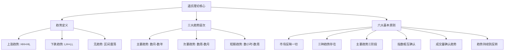

# 指标-道氏理论

## 概述

**道氏理论**是技术分析的基石，由查尔斯·道（Charles Dow）在19世纪末提出，后经威廉·彼得·汉密尔顿（William P. Hamilton）和罗伯特·雷亚（Robert Rhea）系统化整理。它不是一套预测市场的精确方法，而是一种观察和理解市场整体趋势的哲学框架。

## 核心定义

### 趋势的基本定义
道氏理论将市场趋势定义为：

1. **上涨趋势（牛市）**：  
   - **连续更高的高点（Higher Highs, HH）**  
   - **连续更高的低点（Higher Lows, HL）**  

2. **下跌趋势（熊市）**：  
   - **连续更低的高点（Lower Highs, LH）**  
   - **连续更低的低点（Lower Lows, LL）**  

3. **无趋势（盘整/震荡）**：  
   - **高点无明显方向性突破**  
   - **低点无明显方向性突破**  
   - **价格在一定区间内反复波动**

### 道氏理论的三大趋势

道氏理论将市场趋势分为三个层次：

1. **主要趋势（Primary Trend）**  
   - 持续时间：数月到数年  
   - 方向决定市场的长期走向  
   - 通常由基本面驱动（经济周期、政策变化等）

2. **次要趋势（Secondary Trend）**  
   - 持续时间：数周到数月  
   - 是对主要趋势的修正（回调或反弹）  
   - 幅度通常是主要趋势的1/3到2/3

3. **短期趋势（Minor Trend）**  
   - 持续时间：数小时到数周  
   - 日常波动，噪音较大  
   - 技术分析的重点关注对象

## 道氏理论的六大基本原则

1. **市场指数反映一切信息**  
   - 道琼斯工业平均指数和运输业平均指数反映了所有已知信息和预期

2. **市场有三种趋势**  
   - 如上所述的主要趋势、次要趋势和短期趋势

3. **主要趋势有三个阶段**  
   - **积累阶段**：聪明资金开始建仓  
   - **公众参与阶段**：趋势被广泛识别，公众跟进  
   - **过度投机阶段**：市场过热，聪明资金开始离场

4. **指数之间必须相互确认**  
   - 道琼斯工业指数和运输业指数必须相互确认趋势  
   - 在期货交易中，可理解为不同相关品种或不同时间框架的确认

5. **成交量必须确认趋势**  
   - 上涨趋势中，价格上涨时应伴随成交量放大  
   - 下跌趋势中，价格下跌时可放量也可缩量  
   - 成交量是趋势强度的辅助验证指标

6. **趋势持续直到明确的反转信号出现**  
   - 趋势一旦形成，倾向于继续而非反转  
   - 除非有明确的反转信号（如道氏理论的反转确认）

## 趋势识别与确认

### 上涨趋势的确认
1. **结构确认**：形成至少两个连续的HH和HL
2. **突破确认**：价格突破前一个显著高点
3. **回调确认**：回调不跌破前一个显著低点
4. **成交量确认**：上涨时成交量放大，回调时成交量萎缩

### 下跌趋势的确认
1. **结构确认**：形成至少两个连续的LH和LL
2. **跌破确认**：价格跌破前一个显著低点
3. **反弹确认**：反弹不过前一个显著高点
4. **成交量确认**：下跌时成交量可放大（恐慌性抛售）或缩量（阴跌）

### 趋势反转的信号
1. **结构破坏**：
   - 上涨趋势中：价格跌破前一个显著低点（形成LH）
   - 下跌趋势中：价格突破前一个显著高点（形成HH）
2. **双重顶/底**：经典的反转形态
3. **成交量异常**：反转时的成交量显著放大
4. **多时间框架确认**：多个时间框架出现一致的反转信号

## 在期货交易中的应用要点

### 时间框架选择
1. **主要趋势判断**：日线图、周线图
2. **交易时机选择**：4小时图、1小时图
3. **精确入场点**：15分钟图、5分钟图

### 多品种确认
1. **相关品种验证**：如螺纹钢与热卷、铜与铝
2. **产业链验证**：上游原材料与下游成品
3. **跨市场验证**：商品与相关股票、货币走势

### 风险控制
1. **止损设置**：设在趋势结构破坏的位置
2. **仓位管理**：趋势初期轻仓试探，趋势确认后加仓
3. **退出策略**：趋势结构破坏时及时退出

## 局限性

1. **滞后性**：道氏理论是趋势跟随方法，信号相对滞后
2. **主观性**：高点和低点的认定有一定主观成分
3. **假信号**：市场噪音可能导致错误信号
4. **现代市场适应性**：需要结合现代技术分析工具

## 实践建议

1. **从大框架开始**：先确定主要趋势方向
2. **多维度验证**：价格结构、成交量、技术指标综合判断
3. **耐心等待确认**：不急于在趋势初期重仓介入
4. **严格风控**：趋势判断错误时及时止损

## 相关概念

- **趋势线**：连接连续低点（上涨趋势）或连续高点（下跌趋势）
- **通道**：平行于趋势线的另一条线，形成价格运行通道
- **支撑与阻力**：前高点和前低点构成的关键价位
- **123法则**：趋势反转的简化确认方法

---

**创建日期**：2026-04-10  
**创建者**：Warren的交易助理  
**版本**：1.0  
**关联文档**：[[上涨]]、[[下跌]]、[[震荡]]、[[趋势状态机]]

---

## 附录：经典道氏理论图表示例

> **重要提示**：道氏理论是理解市场的基础框架，但在实际交易中需要结合更多技术工具和风险管理策略。技术分析是艺术与科学的结合，需要经验积累和持续学习。