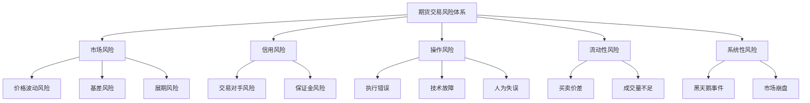
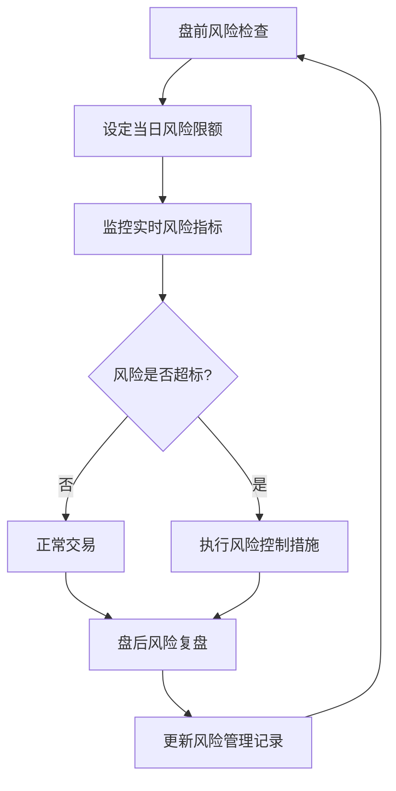

# 期货交易风险管理体系

## 风险管理哲学

### 核心理念
**风险第一，盈利第二** - 在期货交易中，生存比盈利更重要。有效的风险管理是长期稳定盈利的基础。

### 基本原则
1. **预防为主**: 事前风险控制优于事后补救
2. **系统化**: 建立标准化的风险管理流程
3. **多层次**: 从单笔交易到整体账户的多层次防护
4. **动态调整**: 根据市场环境调整风险参数

## 风险层级体系



## 资金管理策略

### 账户资金分配

#### 总资金分配原则
```python
# 资金分配比例
def allocate_capital(total_capital):
    """
    总资金分配方案
    total_capital: 总交易资金
    """
    allocation = {
        'trading_capital': total_capital * 0.70,    # 70% 交易资金
        'reserve_capital': total_capital * 0.20,    # 20% 备用资金
        'emergency_capital': total_capital * 0.10   # 10% 应急资金
    }
    return allocation
```

#### 交易资金细分
1. **活跃交易资金**: 40% - 当前正在交易的资金
2. **待命交易资金**: 30% - 等待交易机会的资金
3. **风险缓冲资金**: 30% - 应对不利情况的缓冲

### 单笔交易风险管理

#### 风险金额计算
```python
def calculate_risk_per_trade(account_balance, risk_percentage=0.02):
    """
    计算单笔交易最大风险金额
    account_balance: 当前账户余额
    risk_percentage: 风险比例，默认2%
    """
    max_risk = account_balance * risk_percentage
    return max_risk
```

#### 仓位大小计算
```python
def calculate_position_size(entry_price, stop_loss_price, max_risk, contract_value):
    """
    计算合约数量
    entry_price: 入场价格
    stop_loss_price: 止损价格
    max_risk: 最大风险金额
    contract_value: 每手合约价值
    """
    price_risk = abs(entry_price - stop_loss_price)
    risk_per_contract = price_risk * contract_value
    position_size = max_risk / risk_per_contract
    return int(position_size)  # 取整数手数
```

### 风险控制规则

#### 单笔交易限制
1. **最大风险**: ≤ 2% 账户资金
2. **最小风险**: ≥ 0.5% 账户资金（避免过度交易）
3. **建议风险**: 1-1.5% 账户资金

#### 单日交易限制
1. **最大亏损**: ≤ 5% 账户资金
2. **连续亏损**: 连续3笔亏损后暂停交易
3. **最大交易次数**: ≤ 10笔/日（避免过度交易）

#### 单品种限制
1. **最大持仓**: ≤ 10% 账户资金
2. **相关性品种**: 高度相关品种总持仓 ≤ 15%
3. **隔夜持仓**: ≤ 5% 账户资金（针对高风险品种）

## 止损策略体系

### 止损类型分类

#### 1. 技术止损
- **支撑阻力止损**: 在关键支撑阻力位下方/上方设置
- **移动平均线止损**: 以重要均线作为止损参考
- **波动率止损**: 基于ATR设置动态止损
- **图表形态止损**: 形态突破失败时止损

#### 2. 资金止损
- **固定金额止损**: 每笔交易固定亏损金额
- **百分比止损**: 按入场资金百分比设置
- **账户比例止损**: 按账户余额百分比设置

#### 3. 时间止损
- **持仓时间止损**: 持仓超过设定时间自动平仓
- **无进展止损**: 价格长时间无进展时平仓

### 止损设置方法

#### 基于波动率的止损
```python
def atr_stop_loss(entry_price, atr_value, multiplier=2, direction='long'):
    """
    基于ATR的止损设置
    entry_price: 入场价格
    atr_value: 平均真实波幅
    multiplier: ATR倍数，默认2倍
    direction: 交易方向，'long'或'short'
    """
    stop_distance = atr_value * multiplier
    
    if direction == 'long':
        stop_loss = entry_price - stop_distance
    else:  # short
        stop_loss = entry_price + stop_distance
    
    return stop_loss
```

#### 基于支撑阻力的止损
```python
def support_resistance_stop_loss(entry_price, support_level, resistance_level, direction='long'):
    """
    基于支撑阻力的止损设置
    entry_price: 入场价格
    support_level: 支撑位价格
    resistance_level: 阻力位价格
    direction: 交易方向
    """
    if direction == 'long':
        # 做多时，止损设在支撑位下方
        stop_loss = support_level * 0.99  # 支撑位下方1%
    else:  # short
        # 做空时，止损设在阻力位上方
        stop_loss = resistance_level * 1.01  # 阻力位上方1%
    
    return stop_loss
```

### 止盈策略

#### 固定风险收益比
```python
def fixed_risk_reward_take_profit(entry_price, stop_loss_price, risk_reward_ratio=2):
    """
    固定风险收益比的止盈设置
    entry_price: 入场价格
    stop_loss_price: 止损价格
    risk_reward_ratio: 风险收益比，默认1:2
    """
    risk_amount = abs(entry_price - stop_loss_price)
    take_profit_distance = risk_amount * risk_reward_ratio
    
    if entry_price > stop_loss_price:  # 做多
        take_profit = entry_price + take_profit_distance
    else:  # 做空
        take_profit = entry_price - take_profit_distance
    
    return take_profit
```

#### 分批止盈策略
1. **第一目标**: 风险收益比1:1，平仓1/3仓位
2. **第二目标**: 风险收益比1:2，平仓1/3仓位
3. **第三目标**: 风险收益比1:3，平仓剩余仓位
4. **移动止损**: 价格达到第一目标后，将止损移至保本价

## 风险监控系统

### 实时风险监控指标

#### 账户层面风险指标
1. **账户风险度**: 当前持仓总风险 / 账户资金
2. **可用保证金比例**: 可用保证金 / 总保证金
3. **浮动盈亏比例**: 浮动盈亏 / 账户资金
4. **最大回撤**: 账户净值从高点回落的最大幅度

#### 持仓层面风险指标
1. **单品种风险度**: 单个品种风险 / 账户资金
2. **相关性风险**: 相关品种组合风险
3. **隔夜风险**: 隔夜持仓风险暴露
4. **流动性风险**: 持仓品种的买卖价差

### 风险预警机制

#### 预警级别设置
```python
class RiskWarningLevel:
    def __init__(self):
        self.levels = {
            'normal': {'account_risk': 0.30, 'action': '正常交易'},
            'warning': {'account_risk': 0.50, 'action': '减少新开仓'},
            'danger': {'account_risk': 0.70, 'action': '停止新开仓'},
            'critical': {'account_risk': 0.85, 'action': '强制减仓'}
        }
    
    def check_risk_level(self, current_risk):
        for level, config in self.levels.items():
            if current_risk <= config['account_risk']:
                return level, config['action']
        return 'critical', '强制平仓'
```

#### 自动风险控制
1. **预警提醒**: 风险达到预警级别时自动提醒
2. **自动减仓**: 风险达到危险级别时自动减仓
3. **强制平仓**: 风险达到临界级别时强制平仓
4. **交易暂停**: 连续亏损或异常波动时暂停交易

## 极端行情应对预案

### 黑天鹅事件应对

#### 事前准备
1. **压力测试**: 定期进行极端行情压力测试
2. **应急预案**: 制定详细的应急预案
3. **流动性储备**: 保持足够的现金储备
4. **对冲策略**: 准备对冲工具和策略

#### 事中应对
1. **立即评估**: 快速评估事件影响程度
2. **风险隔离**: 隔离受影响最大的持仓
3. **对冲操作**: 执行预先准备的对冲策略
4. **减仓保本**: 必要时减仓保护本金

#### 事后恢复
1. **损失评估**: 全面评估实际损失
2. **系统检查**: 检查风险管理系统的有效性
3. **策略调整**: 根据事件调整交易策略
4. **心理恢复**: 帮助交易员心理恢复

### 流动性危机应对
1. **降低仓位**: 提前降低高风险品种仓位
2. **分散交易**: 避免集中在单一品种
3. **限价单优先**: 使用限价单避免滑点
4. **分批操作**: 大额交易分批执行

## 风险管理工具与技术

### 风险分析工具
1. **风险价值(VaR)**: 计算在一定置信水平下的最大可能损失
2. **条件风险价值(CVaR)**: 计算超过VaR的预期损失
3. **压力测试**: 模拟极端市场条件下的损失
4. **情景分析**: 分析特定事件对组合的影响

### 风险对冲工具
1. **期权策略**: 使用期权进行风险对冲
2. **跨品种对冲**: 利用相关品种进行对冲
3. **跨期对冲**: 利用不同期限合约进行对冲
4. **跨市场对冲**: 利用不同市场进行对冲

## 风险管理流程

### 日常风险管理流程


### 风险管理文档
1. **风险政策手册**: 明确的风险管理政策和流程
2. **风险限额表**: 各层级的风险限额设置
3. **风险事件记录**: 记录所有风险事件和处理过程
4. **风险报告**: 定期生成风险管理报告

## 团队风险管理

### 角色与职责
1. **交易员**: 执行单笔交易风险管理
2. **风险监控员**: 监控整体账户风险
3. **风险经理**: 制定风险管理策略
4. **团队负责人**: 最终风险决策责任

### 风险沟通机制
1. **每日风险会议**: 讨论当日风险状况
2. **风险预警通报**: 及时通报风险预警信息
3. **风险事件报告**: 报告和处理风险事件
4. **风险管理培训**: 定期进行风险管理培训

---
*风险管理体系版本: 1.0*
*适用对象: 期货交易个人及团队*
*最后更新: 2026年4月10日*